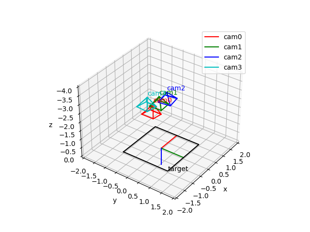

# Camera Calibration
Camera calibration based on Zhang's method.

calibrate() method of CalibrateCamera class receives world coordinates of corner points and their corresponding image points from at least 3 images taken at different angles and positions. Then the method computes intrinsic parameters, distortion and extrinsic parameters.

```python
calib = CalibrateCamera()
calib.calibrate(pt_world, pt_images)        
calib.print_parameters()

# Process the results
# calib.intrinsic : dictionary of intrinsic parameters
# calib.extrinsics : list of dictionary of extrinsic parameters

# Visualize
vis = Visualizer()
vis.visualize_cameras(calib.extrinsics)
```




## Axis
### Image coordinate
* $u$: Lateral axis. Leftward direction is positive.
* $v$: Vertical axis. Downward direction is positive.

### World coordinate
* $x$: Lateral axis. Leftward direction is positive
* $y$: Vertical axis. Downward direction is positive.
* $z$: Longitudinal axis. Forward direction is positive.


## Intrinsic camera parameters

* $f_u$ focal length in u-axis
* $f_v$ focal length in v-axis
* $cu$ center of image in u-axis
* $cv$ center of image in v-axis
* skew is assumed to be 0

$$K = \begin{bmatrix} f_u & 0 & cu \\\\ 0 & f_v & cv \\\\ 0 & 0 & 1 \end{bmatrix}$$

## Extrinsic camera parameters
* $t_x$ translation in x-axis
* $t_y$ translation in y-axis
* $t_z$ translation in z-axis

* $\phi$ rotation around x-axis
* $\theta$ rotation around y-axis
* $\psi$ rotation around z-axis

## Lens distortion

This code computes radial distortion only. Tangential distortion is ignored.

Lens distortion model converts undistorted image coordinate $(u,v)$ into distorted image coordinate $(u_d, v_d)$


$u_n = \frac{(u - cu)}{f_u}$

$v_n = \frac{(v - cv)}{f_v}$

$r_n^2 = u_n^2 + v_n^2$

$ratio = 1 + \kappa_1 r_n^2 + \kappa_2 r_n^4 + + \kappa_3 r_n^6$

$u_d = f_u \cdot ratio \cdot u_n + cu$

$v_d = f_v \cdot ratio \cdot v_n + cv$

## Homography
Compute homography with $z=0$

$$p = \begin{bmatrix}w\cdot u\\\\w\cdot v\\\\w\end{bmatrix} = H\begin{bmatrix}x \\\\ y \\\\ 1\end{bmatrix}$$

where

$$H = \begin{bmatrix}h_{11} & h_{12} & h_{13} \\\\ h_{21} & h_{22} & h_{23} \\\\ h_{31} & h_{32} & h_{33}\end{bmatrix}$$

Since multiplying the numerator and the denominator by a constant yields the same result,

$$u = \frac{h_{11}x + h_{12}y + h_{13}}{h_{31}x + h_{32}y + h_{33}} = \frac{\alpha \left(h_{11}x + h_{12}y + h_{13}\right)}{\alpha \left(h_{31}x + h_{32}y + h_{33}\right)}$$

$$v = \frac{h_{21}x + h_{22}y + h_{23}}{h_{31}x + h_{32}y + h_{33}}= \frac{\alpha \left(h_{21}x + h_{22}y + h_{23}\right)}{\alpha \left(h_{31}x + h_{32}y + h_{33}\right)}$$

the computation can be simplified by setting $\alpha = 1/h_{33}$

$$H = \begin{bmatrix}h_{11} & h_{12} & h_{13} \\\\ h_{21} & h_{22} & h_{23} \\\\ h_{31} & h_{32} & 1\end{bmatrix}$$

The homography can be solved as

$$Ax=b$$

where 

$$A=\begin{bmatrix}- x & - y & -1 & 0 & 0 & 0 & u x & u y\\\\0 & 0 & 0 & - x & - y & -1 & v x & v y\end{bmatrix}$$

$$b=\begin{bmatrix}- u\\\\- v\end{bmatrix}$$

For detailed process of symbolic computation, please refer to [doc/homography.ipynb](doc/homography.ipynb)

The computation of homography matrices is implemented in compute_homography() in [calibrate_camera.py](calibrate_camera.py)

## Initial values

$$\begin{bmatrix}w\cdot u\\\\w\cdot v\\\\w\end{bmatrix} = H\begin{bmatrix}x \\\\ y \\\\ 1\end{bmatrix}$$

where $H = \lambda K\begin{bmatrix}r_1 & r_2 & t\end{bmatrix}$, $r_1$ and $r_2$ are the 1st and the 2nd column vectors of the rotation matrix $R$ and $t$ is translation vector. $\lambda$ is an arbitrary scalar.


Let's denote $H = \begin{bmatrix}h_1 & h_2 & h_3\end{bmatrix}$. Then $K$, $r_1$ and $r_2$ can be decomposed by exploiting orthogonality of $R$.

$h_1=\lambda K r_1$

$h_2=\lambda K r_2$

$r_1 = \frac{1}{\lambda} K^{-1}h_1$

$r_2 = \frac{1}{\lambda} K^{-1}h_2$

$r_1^T r_2 = h_1^TK^{-T}K^{-1}h_2 = 0$

$r_1^T r_1 = r_2^T r_2 = h_1^TK^{-T}K^{-1}h_1 = h_2^TK^{-T}K^{-1}h_2$

The above equations can be rewritten as

$h_1^TBh_2 = 0$

$h_1^TBh_1 - h_2^TBh_2 = 0$

$$ B = K^{-T} K^{-1} = \begin{bmatrix}\frac{1}{f_{u}^{2}} & 0 & - \frac{cu}{f_{u}^{2}}\\\\0 & \frac{1}{f_{v}^{2}} & - \frac{cv}{f_{v}^{2}}\\\\- \frac{cu}{f_{u}^{2}} & - \frac{cv}{f_{v}^{2}} & \frac{cu^{2}}{f_{u}^{2}} + \frac{cv^{2}}{f_{v}^{2}} + 1\end{bmatrix} = \begin{bmatrix}b_{11} & 0 & b_{13} \\\\ 0 & b_{22} & b_{23} \\\\ b_{13} & b_{23} & b_{33} \end{bmatrix}$$

Then the elements of $B$ matrix can be computed by the following homogeneous equation.
$$Vb = 0$$
where
$$V=\begin{bmatrix}h_{11} h_{12} & h_{11} h_{32} + h_{12} h_{31} & h_{21} h_{22} & h_{21} h_{32} + h_{22} h_{31} & h_{31} h_{32}\\\\h_{11}^{2} - h_{12}^{2} & 2 h_{11} h_{31} - 2 h_{12} h_{32} & h_{21}^{2} - h_{22}^{2} & 2 h_{21} h_{31} - 2 h_{22} h_{32} & h_{31}^{2} - h_{32}^{2}\end{bmatrix}$$
$$b = \begin{bmatrix}b_{11} & b_{13} & b_{22} & b_{23} & b_{33}\end{bmatrix}^T$$


Since $B$ matrix has an arbitrary scale factor $B=\frac{1}{\lambda^2} K^{-T}K^{-1}$, the parameters are computed as follows.

$$ B = K^{-T} K^{-1} = \begin{bmatrix}\frac{1}{\lambda^2}\frac{1}{f_{u}^{2}} & 0 & - \frac{1}{\lambda^2}\frac{cu}{f_{u}^{2}}\\\\0 & \frac{1}{\lambda^2}\frac{1}{f_{v}^{2}} & - \frac{1}{\lambda^2}\frac{cv}{f_{v}^{2}}\\\\- \frac{1}{\lambda^2}\frac{cu}{f_{u}^{2}} & - \frac{1}{\lambda^2}\frac{cv}{f_{v}^{2}} & \frac{1}{\lambda^2}\left(\frac{cu^{2}}{f_{u}^{2}} + \frac{cv^{2}}{f_{v}^{2}} + 1\right)\end{bmatrix} = \begin{bmatrix}b_{11} & 0 & b_{13} \\\\ 0 & b_{22} & b_{23} \\\\ b_{13} & b_{23} & b_{33} \end{bmatrix}$$

$cu = -b_{13}/b_{11}$

$cv = -b_{23}/b_{22}$

$s=\frac{1}{\lambda^2}=b_{33} + b_{13}cu + b_{23}cv$

$f_u = \sqrt{b_{11} / s}$

$f_v = \sqrt{b_{22} / s}$

Now we can decompose extrinsic camera parameters

$$H = \lambda K\cdot RT$$
$$K^{-1}H = \begin{bmatrix} K^{-1} h_1 & K^{-1} h_2 & K^{-1} h_3 \end{bmatrix} = \lambda RT = \begin{bmatrix} \lambda r_1 & \lambda r_2 & \lambda rt \end{bmatrix}$$

The scale factor $\lambda$ can be computed exploiting orthonormality of rotation matrix.
$$\lambda = \sqrt{\lVert K^{-1} h_1 \rVert} = \sqrt{\lVert K^{-1} h_2 \rVert} $$

Since rotation matrix $R$ is orthogonal, the 3rd column of $R$ can be comptued as 

$$r_3=r_1 \times r_2$$

The 3rd column of $K^{-1}H$ is $\lambda Rt$ Translation vector $t$ can be decompused as follows since the transpose of orthogonal matrix is equivalent to its inverse.

$$t = R^Trt = \begin{bmatrix}t_x & t_y & t_z\end{bmatrix}^T$$

### Rotation angle estimation

$$ R_q = R_zR_yR_x = \begin{bmatrix}\cos{\psi} \cos{\theta} & \sin{\phi} \sin{\theta} \cos{\psi} - \sin{\psi} \cos{\phi} & \sin{\phi} \sin{\psi} + \sin{\theta} \cos{\phi} \cos{\psi}\\\\ \sin{\psi} \cos{\theta} & \sin{\phi} \sin{\psi} \sin{\theta} + \cos{\phi} \cos{\psi} & - \sin{\phi} \cos{\psi} + \sin{\psi} \sin{\theta} \cos{\phi}\\\\- \sin{\theta} & \sin{\phi} \cos{\theta} & \cos{\phi} \cos{\theta}\end{bmatrix} $$

$$\phi = atan\left(\frac{r_{3,2}}{r_{3,3}}\right)$$

$$ \theta = -asin(r_{3,1}) $$

$$ \psi = atan\left(\frac{r_{2,1}}{r_{1,1}}\right) $$


Please note that $R$ may not satisfies the properties of a rotation matrix (e.g. orthogonality) due to noise. However it can be good initial values for non-linear optimization.


For detailed process of symbolic computation, please refer to [doc/initial_value.ipynb](doc/initial_value.ipynb)

The computation of the initial values is implemented in compute_initial_values() in [calibrate_camera.py](calibrate_camera.py)


The computation of initial values is validated by unit test using simulated data. The test code is implemented in [test_calibration_init.py](test_calibration_init.py).


## Refinement
The initial values have the following defects.

* Orthogonality of rotation matrices is not guaranteed.
* Lens distortion is ignored.

To improve the defects, parameters are refined in such a way that the reprojection error is minimized.

The reprojection error is computed as follows.

### 1. Compute camera coordinates

$$ RT = \begin{bmatrix}R & t'\end{bmatrix}$$
$$ \begin{bmatrix}x_c \\\\ y_c \\\\ z_c\end{bmatrix} = RT\begin{bmatrix} x \\\\ y \\\\ z \\\\ 1\end{bmatrix}$$

where $t'=Rt$ for simplyfing computation.

### 2. Compute lens distortion (radial distortion only)

$$r^2 = u_n^2 + v_n^2$$
$$ratio = 1 + \kappa_1 r^2 + \kappa_2 r^4 + \kappa_3 r^6$$

where 
$$u_n = \frac{u - cu}{f_u} = x_c/z_c$$
$$v_n = \frac{v - cv}{f_v} = x_c/z_c$$

Then the reprojection error is as follows

$$u_d = f_u \cdot ratio \cdot u_n + cu$$
$$v_d = f_v \cdot ratio \cdot v_n + cv$$

$$e_u = u_d - u_{target}$$
$$e_v = v_d - v_{target}$$


### 3. Optimization
$$f(x) = \begin{bmatrix}e_{u,i,j}\\\\e_{v,i,j}\end{bmatrix}$$
$$e(p) = \sum_{i,j}{\lVert f(x) \rVert}^2 $$
Summation of errors over image $i$ and point $j$.

$$f(p) = f(p + \Delta p) \approx f(p) + \frac{\partial f}{\partial p}\Delta p$$

$$e = \sum_{i,j}{\left\lVert f(p) + \frac{\partial f}{\partial p}\Delta p \right\rVert}^2$$

$$\frac{\partial e}{\partial \Delta p} = 2\sum{J^T\left(f(p) + J\Delta p\right)} = 0$$
where $J = \frac{\partial f}{\partial p}$


Repeat the following computation until the parameter converges. This implementation uses Levenberg-Marquardt method for better convergence.
$$\Delta p = \left[J^T J\right]^{-1} J^T f(p)$$
$$p \leftarrow p + \Delta p$$

This process is implemented in refine_parameters() in [calibrate_camera.py](calibrate_camera.py) and validated in [test_calibration_optimization.py](test_calibration_optimization.py). All the estimated parameters satisfy accuracy of 1e-6. Reprojection error and its derivatives are derived by sympy. Then the resulting code are optimized by grouping common terms. For detailed computation process, please refer to [doc/optimization.ipynb](doc/optimization.ipynb)

In the refinement of rotation matrix, quaternion is used instead of Euler angle to make derivatives simple. For explanation of quaternion, please refer to [https://github.com/trip2eee/quatlib](https://github.com/trip2eee/quatlib).


# Reference
Z. Zhang. A flexible new technique for camera calibration. IEEE Transactions on Pattern Analysis and Machine Intelligence, 22(11):1330-1334, 2000

